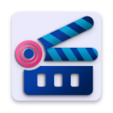
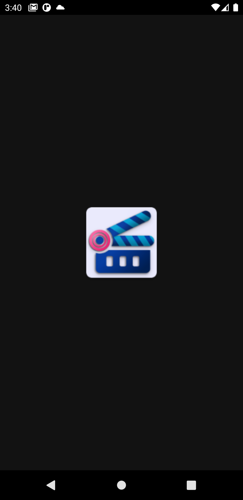
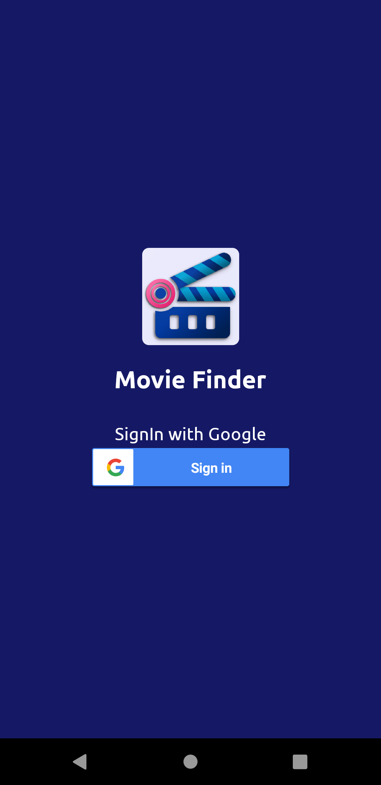
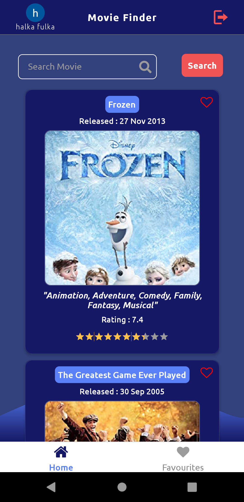
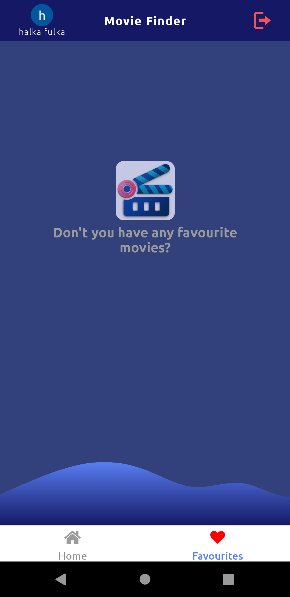
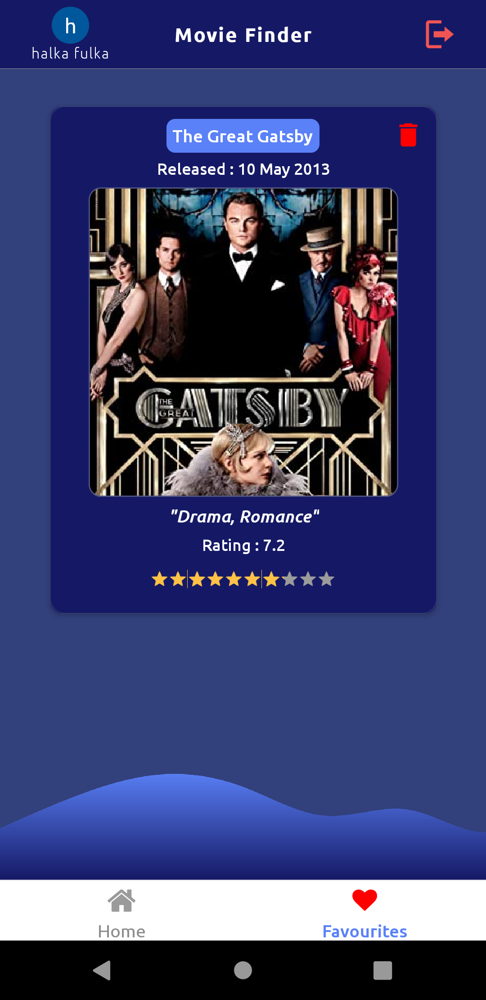
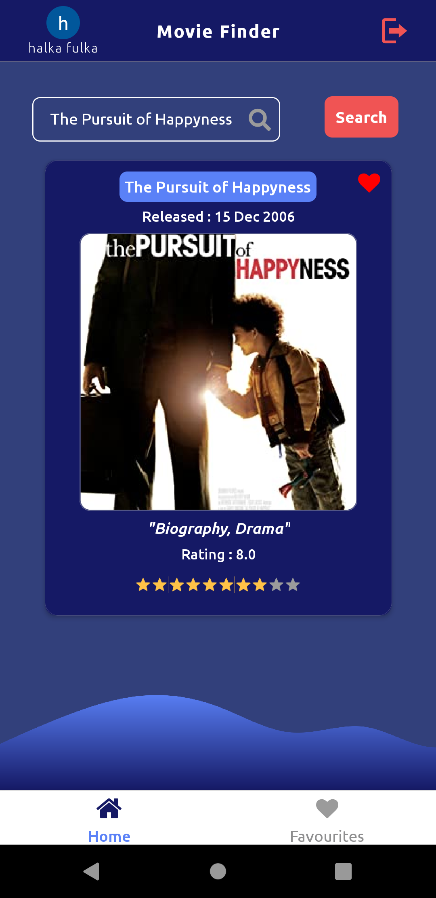

<div style="text-align:left"></div>

# Movie Info Finder

This is a super simple movie searching application that allows users to search different movies. Movies info includes movie genre, release date, IMDB rating and etc. Beside search movies users can also save their favorite movies which they can be reviewed later in the favorite tab.

#### Technologies Used

- React Native
- Typescript
- Functional Component
- Composite Component
- React Hooks
- React Navigation
- Axios
- OMDB Movie API
- Async Storage
- git


#### Development Environment

- Linux (Ubuntu 20.04)
- NodeJs
- Android SDK
- Android Emulator

### Running the project
If you want to run the project please proceed with the following instructions,
  1. Setup React Native Environment ([Environment Setup Link](https://reactnative.dev/docs/environment-setup#development-os))
  2. Download the project,
     ```
     git clone https://github.com/absjabed/movie-finder.git
     cd movie-finder
     ```
  3. Install the dependencies,
     ```
     yarn install
     ```
  4. Start Android Emulator and check if it's available with `adb devices`
  5. In separate terminal Run following command for (Metro Bundler),
     ```
     npx react-native start
     ```
  6. To run the project in the emulator,
     ```
     npx react-native run-android
     ```
  7. If running fails follow the instruction below,
     ```
     # for linux
     
     cd android
     ./gradlew clean
     
     # for windows 
     gradlew clean

     # again run
     npx react-native run-android
     ```
  8. To run the tests,
     ```
     yarn test
     ```
  9. If `snapshot` test fails for no reason, update snapshots with below command,
     ```
     yarn test -u 
     ```
    
---

### Building the release apk using containerization (Docker)
If you have docker installed and have internet connect please follow the steps to build release,

  1. Clone the project
     ```
     git clone https://github.com/absjabed/movie-finder.git
     cd movie-finder
     ```
  2. Run the following command to build the project,
     ```
     docker run -it --rm -v $PWD:/app -w /app reactnativecommunity/react-native-android /bin/bash -c "yarn install && cd /app/android && ./gradlew assembleRelease"
     ```
  3. Find your apk file in the following location of your current directory (movie-finder)
     ```
     movie-finder/android/app/build/outputs/apk/release/apk-release.apk
     ```

### Building the release apk (Manually)
If you want to build the release apk please proceed with the following instructions,
  
  1. Download the project,
     ```
     git clone https://github.com/absjabed/movie-finder.git
     cd movie-finder
     ```
  2. To install the yarn dependencies,
     ```
     yarn install
     ```
  3. To clean the previous gradle build,
     ```
     cd android

     # for linux
     ./gradlew clean

     # for windows
     gradlew clean
     ```
  4. To build the release apk
     ```
     ./gradlew assembleRelease
     ```
  5. If you want to build release apk with Emulator Connected
     ```
     npx react-native run-android --variant=release
     ```
  6. Finally, find the apk in the following locaiton,
     ```
     movie-finder/android/app/build/outputs/apk/release/apk-release.apk
     ```
  
---


## Application Demo
### Application Video
To see a live demo please visit: [App-Video-Link]()

---

### App Screenshots (with usecases)
Left             |  Right
:-------------------------:|:-------------------------:
  |  |
 |    |
 | |
 |

